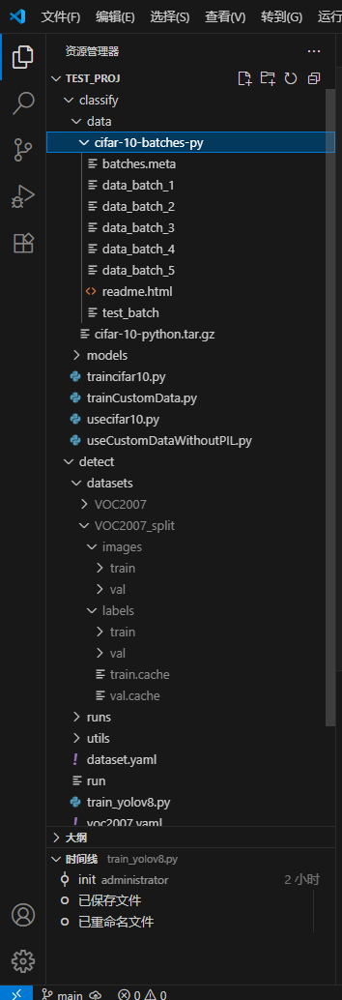

A quick start for computer vision AI study.

classification + object detection

## dataset
format is shown as Figure

the VOC2007 dataset can be downloaded from https://tianchi.aliyun.com/dataset/94847

the cifar dataset can be downloaded automatically from the script

## environment 

`pip install torch torchvision torchaudio`

or

`conda install torch torchvision torchaudio`